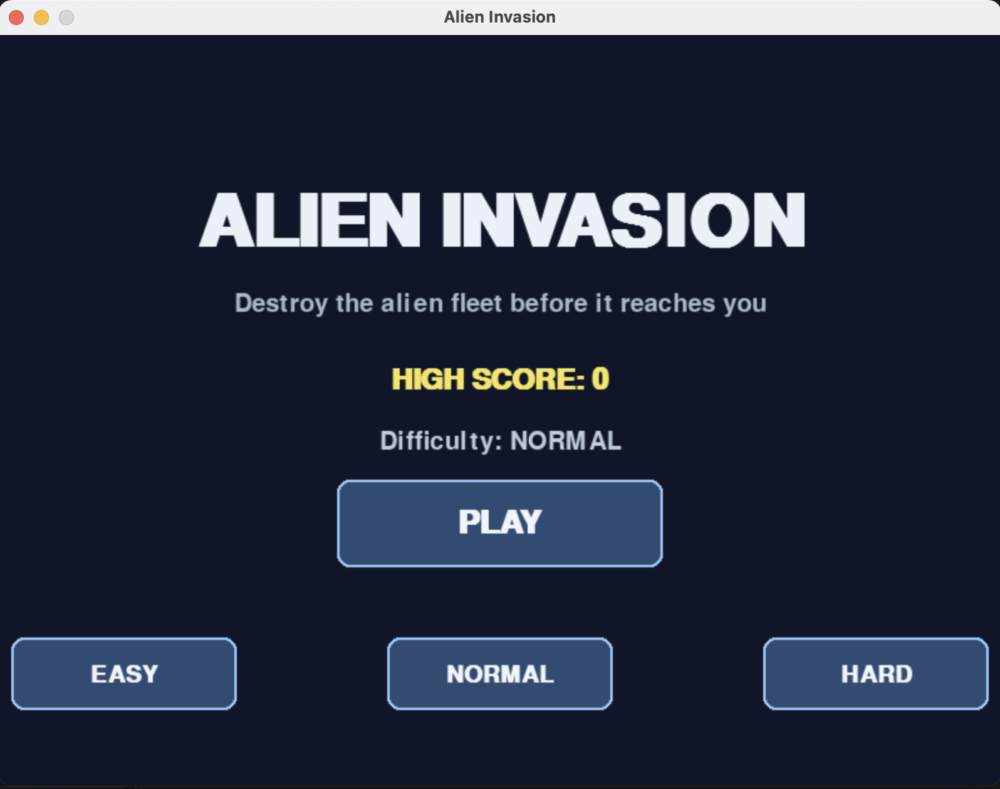
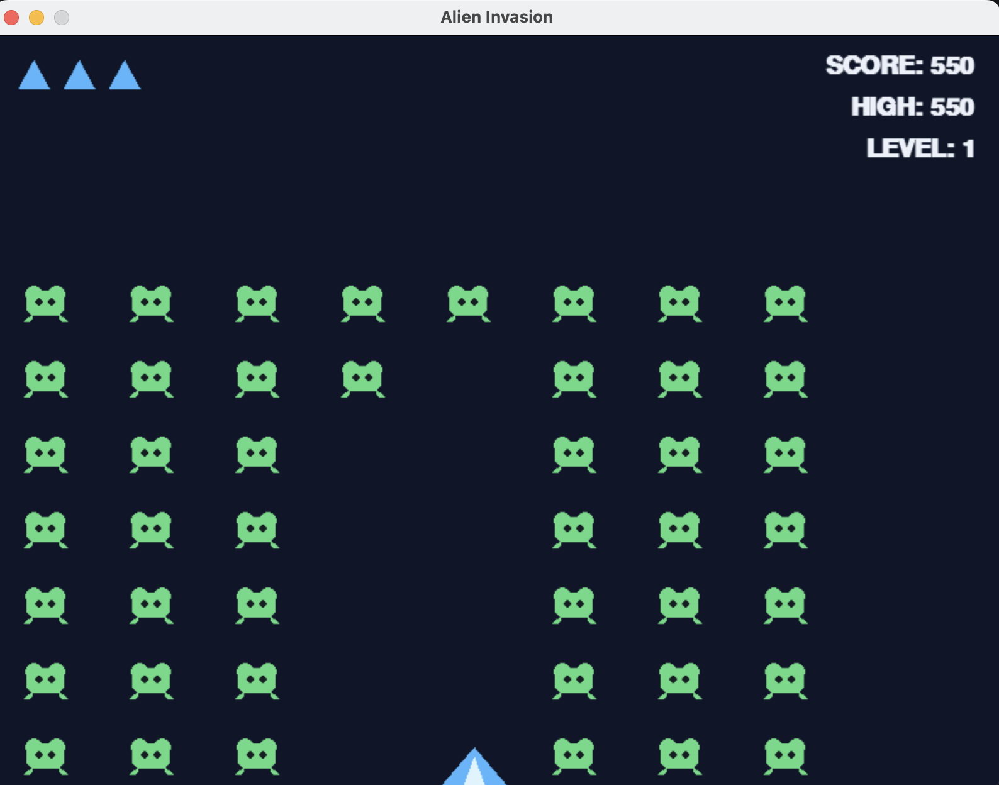

# Alien Invasion — Practical Work

Проект на Pygame по материалам практической работы:
- корабль игрока и движение влево/вправо;
- стрельба пробелом, максимум 3 снаряда;
- флот пришельцев, движение в стороны и вниз;
- столкновения снарядов с пришельцами;
- 3 корабля игрока;
- уровни с постепенным ускорением;
- очки, рекорд и уровень на экране;
- сохранение исторического рекорда в `highscore.txt`;
- запуск клавишей `P` и кнопкой `PLAY`;
- выбор начальной сложности: EASY / NORMAL / HARD.

Изображения не нужны: корабль и пришельцы рисуются средствами Pygame.

## Скриншоты игры

## Запуск в VS Code

1. Создайте/откройте папку проекта.
2. В терминале выполните:
   `python -m pip install -r requirements.txt`
3. Запустите:
   `python alien_invasion.py`

Если команда `python` не работает, используйте `python3`.

## Управление

- ← / → — движение корабля
- Space — выстрел
- P — начать игру
- Esc — выйти
- мышь — кнопки меню

Рекорд хранится в `highscore.txt`.
